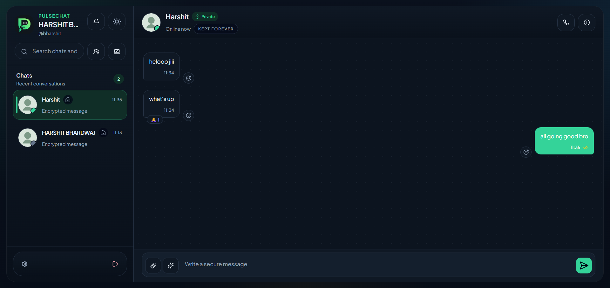
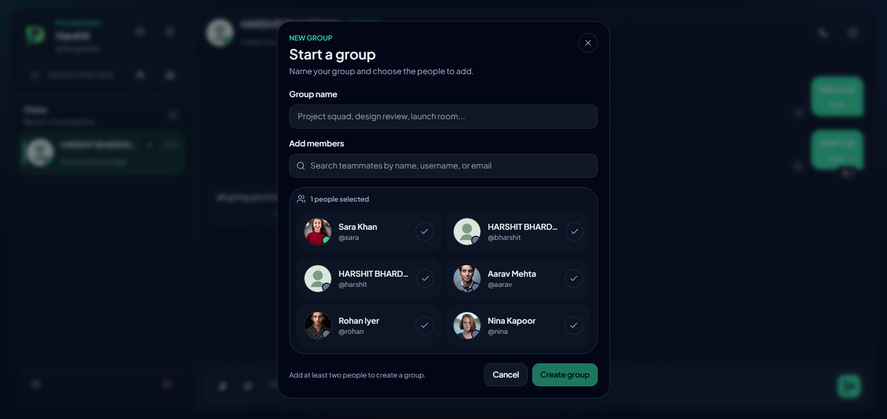
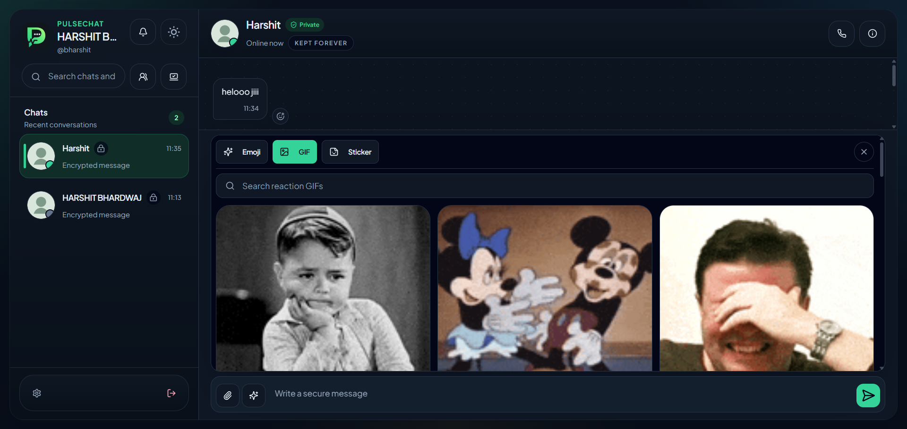
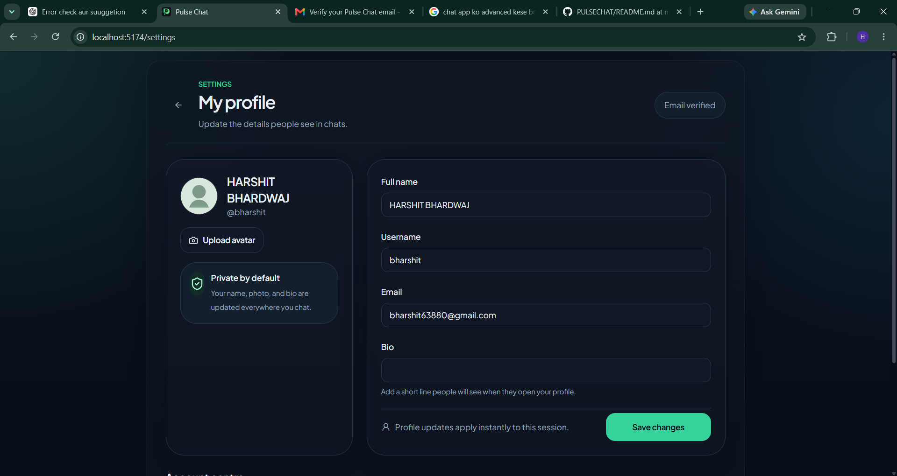
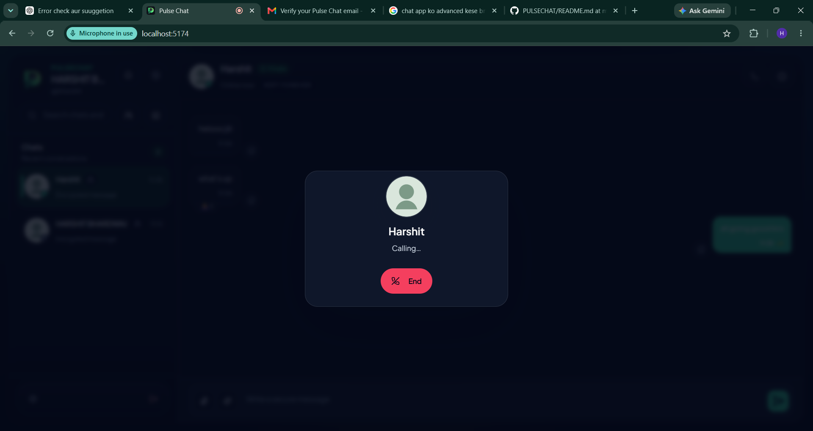
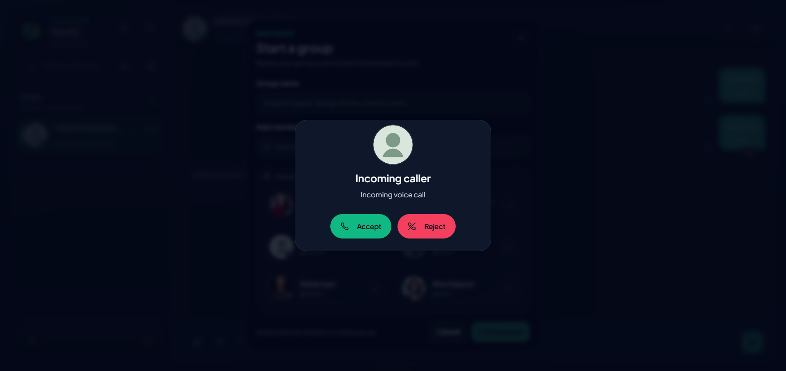
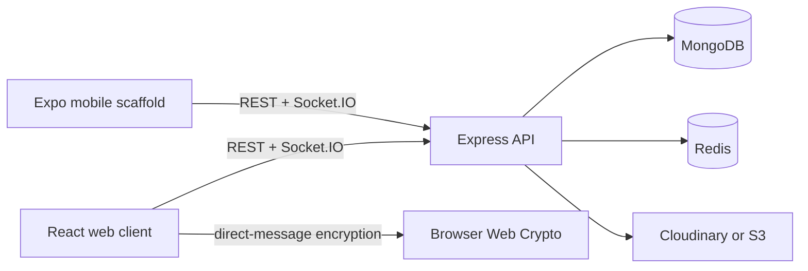

# PulseChat

> A private, real-time messaging workspace built with React, Node.js, Socket.IO, MongoDB, and browser-side cryptography.


## Product preview

| Private conversations | Group creation |
| --- | --- |
|  |  |

| Media sharing | Profile & account centre |
| --- | --- |
|  |  |

| Outgoing call state | Incoming call state |
| --- | --- |
|  |  |

## Why PulseChat

PulseChat is a production-minded monorepo for direct messaging, groups, secure device sessions, and encrypted direct-message transport. The product pairs a polished React experience with explicit backend authorization, honest privacy boundaries, and operational tooling for local development.

### Highlights

- **Private direct messages** — browser-side key generation and ciphertext-only direct-message persistence.
- **Real-time chat** — Socket.IO presence, typing, delivery/seen states, reactions, unread counts, optimistic outbox retry, and notifications.
- **Media that stays private** — encrypted direct-chat file, image, GIF, and sticker attachments.
- **Account protection** — email verification, rotating refresh tokens, HTTP-only cookies, device-aware sessions, and session revocation.
- **Conversation controls** — disappearing-message timers, safety-number UX, local decrypted search, and responsive dark/light UI.
- **Product-ready workspace** — React web client, Express API, Expo mobile scaffold, Redis support, Docker setup, CI, and typed shared contracts.

> **Calling status:** one-to-one audio calling has an in-progress WebRTC foundation (authorized signaling, peer lifecycle, and UI). It still requires complete two-browser verification and TURN configuration before staging or production use.

## Architecture



| Layer | Responsibilities |
| --- | --- |
| `apps/web` | React UI, local device keys, direct-message encryption, decrypted local search, sockets, media UX |
| `apps/api` | Authentication, device sessions, public-key distribution, ciphertext persistence, uploads, notifications, Socket.IO |
| `apps/mobile` | Expo mobile scaffold, secure auth/session boundary, direct-chat surfaces |
| `packages/shared` | DTOs, Zod schemas, socket event constants, and response helpers |

## Security model

- Direct-message plaintext is encrypted in the browser before it is transported or persisted.
- Private keys stay on the client device; the API stores public device keys, ciphertext, and metadata.
- Direct-message search is local to browser storage.
- Group chat is an explicitly documented **server-group text MVP**; it is not end-to-end encrypted.
- This project does **not** claim Signal-style multi-device ratcheting or production-ready calling.

Read the full model in [E2EE documentation](docs/e2ee.md).

## Quick start

### Prerequisites

- Node.js 20+
- MongoDB
- Redis (recommended for presence/cache and multi-instance Socket.IO)

### Run locally

```bash
npm install
cp .env.example .env
npm run seed
npm run dev
```

Default development addresses:

| Service | Address |
| --- | --- |
| Web | `http://localhost:5173` |
| API | `http://localhost:5000/api/v1` |
| Mobile | `npm run dev:mobile` |

For the local container stack:

```bash
docker compose up --build
```

## Demo accounts

After seeding:

| Email | Password |
| --- | --- |
| `aarav@example.com` | `Password123!` |
| `sara@example.com` | `Password123!` |
| `rohan@example.com` | `Password123!` |
| `nina@example.com` | `Password123!` |

## Commands

```bash
npm run dev          # web, API, and shared package
npm run build        # production builds
npm run lint         # lint all workspaces
npm run typecheck    # check all workspaces
npm run test         # API test suite
npm run seed         # seed local demo accounts
```

## Configuration

Copy [`.env.example`](.env.example) to `.env`; never commit real credentials.

Key configuration groups:

- **Core:** `MONGODB_URI`, `JWT_SECRET`, `REFRESH_TOKEN_SECRET`, `CLIENT_URL`, `APP_URL`
- **Realtime:** `REDIS_URL`, `REDIS_KEY_PREFIX`
- **Mail:** `RESEND_API_KEY`, `RESEND_FROM` (recommended for hosted deployments), or SMTP variables for environments that allow SMTP egress
- **Uploads:** `UPLOAD_PROVIDER`, Cloudinary or S3 variables
- **Web:** `VITE_API_URL`, `VITE_SOCKET_URL`, `VITE_GIPHY_API_KEY`

For deployment prerequisites, see [deployment documentation](docs/deployment.md).

## Documentation

- [Architecture](docs/architecture.md)
- [API reference](docs/api.md)
- [Socket events](docs/socket-events.md)
- [Testing](docs/testing.md)
- [Encryption and privacy limits](docs/e2ee.md)

## Roadmap

- Complete and real-device test one-to-one WebRTC audio/video calling
- Add TURN credential delivery for reliable NAT traversal
- Add forward secrecy and multi-device direct-message fan-out
- Replace the server-group MVP with secure group messaging

---

Built as a full-stack private messaging workspace with explicit security boundaries and a focus on everyday usability.
