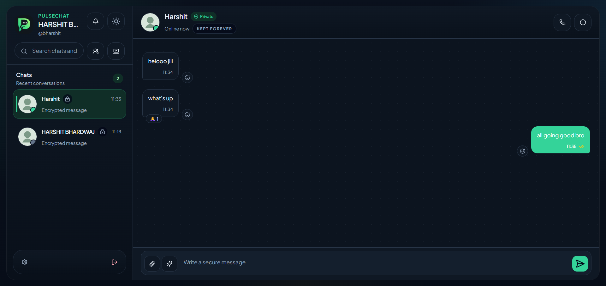
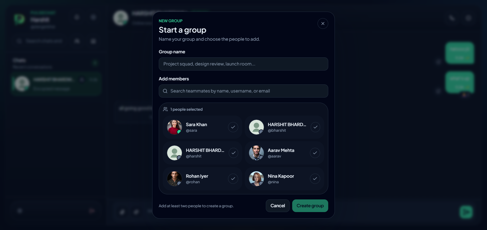
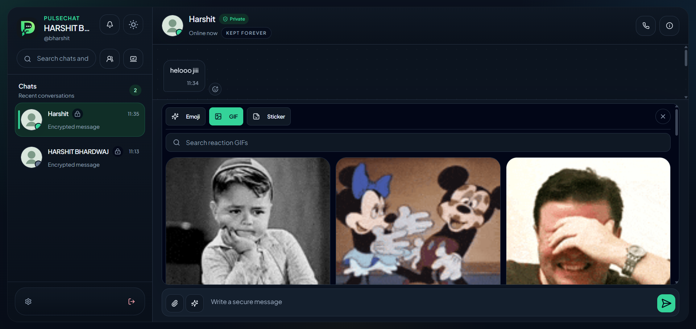
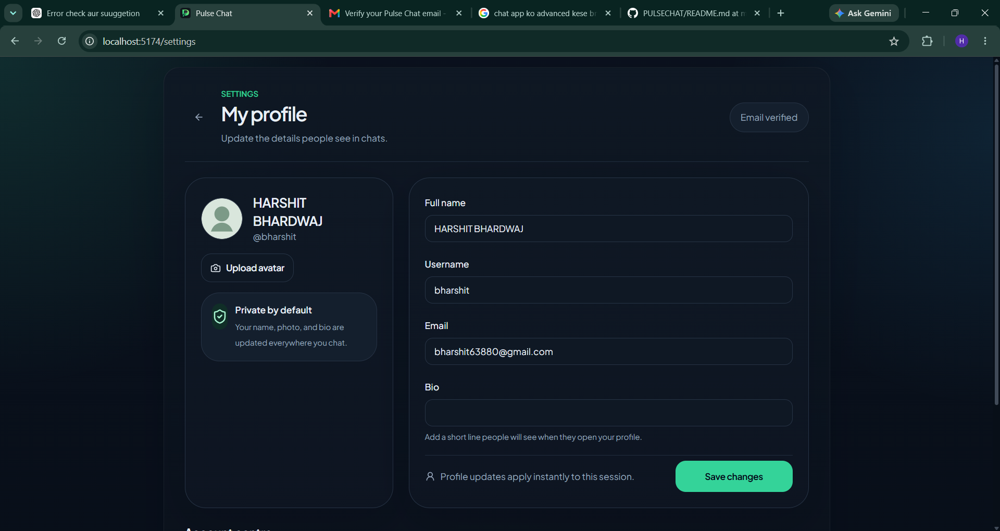
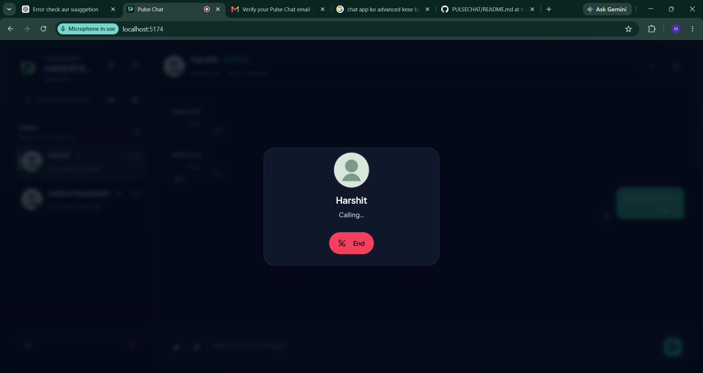
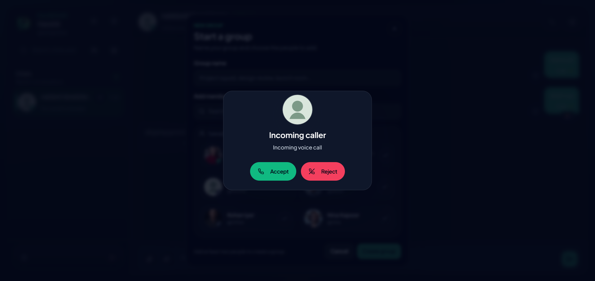

# PulseChat

> A private, real-time messaging workspace built with React, Node.js, Socket.IO, MongoDB, Redis, and browser-side cryptography.

PulseChat is a full-stack messaging monorepo focused on **real-time communication, secure device sessions, client-side encryption for direct messages, encrypted media, and everyday messaging workflows**.

The project deliberately documents its security boundaries and current limitations instead of claiming production-grade cryptography or calling infrastructure that is not yet complete.

---

## 📸 Product Preview

| Private Conversations | Group Creation |
| --- | --- |
|  |  |

| Media Sharing | Profile & Account Centre |
| --- | --- |
|  |  |

| Outgoing Call State | Incoming Call State |
| --- | --- |
|  |  |

---

# 🎯 Why PulseChat?

Modern messaging applications require more than simply sending messages between two users.

PulseChat brings together:

- Real-time messaging
- One-to-one conversations
- Group conversations
- Presence indicators
- Typing indicators
- Delivery and seen states
- Message reactions
- Unread counts
- Optimistic message sending
- Retryable offline outbox
- Direct-message client-side encryption
- Encrypted direct-chat media
- Device-aware authentication
- Rotating refresh tokens
- Session revocation
- Email verification
- Disappearing messages
- Local decrypted message search
- Redis-backed real-time infrastructure
- Shared TypeScript contracts

The project is structured as a monorepo so that the web client, API, mobile scaffold, and shared contracts can evolve together.

---

# ✨ Core Features

## 💬 Real-Time Messaging

PulseChat supports normal messaging workflows while maintaining real-time communication between connected clients.

### Supported

- One-to-one conversations
- Group conversations
- Real-time message delivery
- Presence indicators
- Typing indicators
- Delivery states
- Seen/read states
- Message reactions
- Unread counts
- Optimistic message sending
- Retryable message outbox
- Real-time notifications
- Conversation updates

Communication is handled through **Socket.IO**, while REST APIs are used for operations that do not require persistent socket communication.

---

# 🔐 Private Direct Messages

Direct messages use browser-side encryption.

The basic flow is:

```text
Plaintext Message
       │
       ▼
Browser Web Crypto
       │
       ▼
Encrypted Ciphertext
       │
       ▼
Socket.IO / REST API
       │
       ▼
Express API
       │
       ▼
MongoDB
